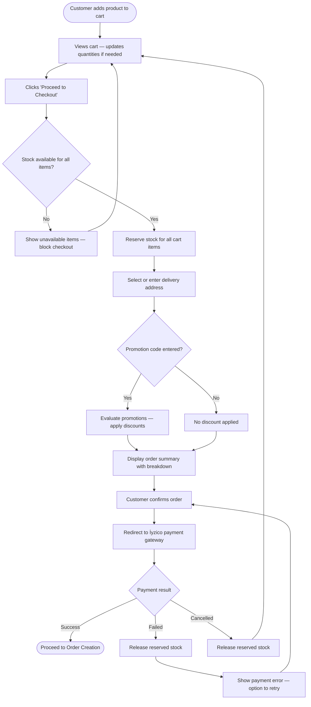
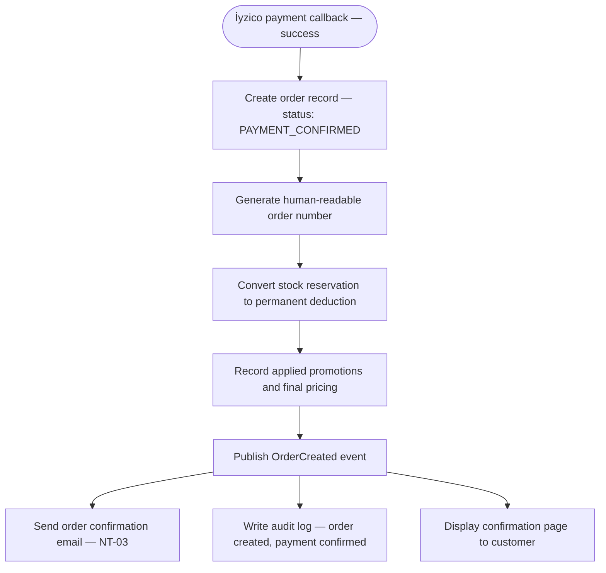
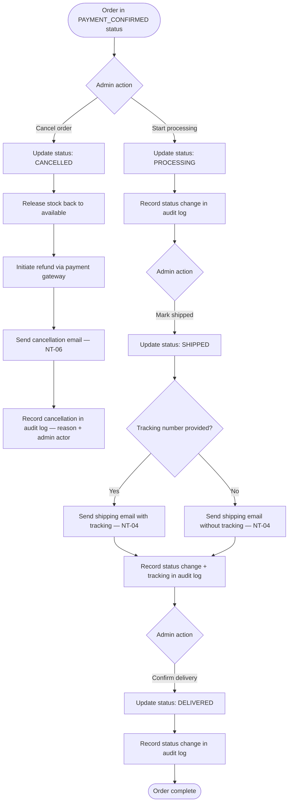

# Order Process

**Document:** `docs/02-business-processes/order-process.md`  
**Last Updated:** March 2025  
**Related Requirements:** CC-01 to CC-09, OM-01 to OM-07, NT-03 to NT-06, AT-01 to AT-06, PAY-01 to PAY-03  
**Related Processes:** [Stock Reservation](./stock-reservation-process.md) · [Promotion Evaluation](./promotion-evaluation-process.md)

---

## Overview

This document describes the end-to-end order lifecycle — from the moment a customer adds a product to their cart through to delivery (or cancellation). It is the central process of the platform and touches every other business process at some point.

The order process is divided into three phases:

1. **Customer Phase** — Cart management, checkout, and payment
2. **System Phase** — Order creation, stock deduction, and notification dispatch
3. **Admin Phase** — Order fulfillment and status management

---

## 1. Customer Phase — Cart to Payment

### 1.1 Cart Management

A logged-in customer browses the catalog and adds products (with a specific variant selected) to their cart.

**Rules:**
- Each cart item references a specific product variant (e.g., iPhone 15, 256GB, Black).
- The customer can update quantities or remove items at any time.
- The cart persists across browser sessions for logged-in customers (CC-03).
- The cart displays real-time stock availability. If a variant goes out of stock while in the cart, the item is visually flagged and cannot proceed to checkout.

No stock is reserved at this stage. Reservation begins only when the customer initiates checkout (see [Stock Reservation Process](./stock-reservation-process.md)).

### 1.2 Checkout Initiation

When the customer clicks "Proceed to Checkout," the following happens in sequence:

1. **Stock reservation is triggered** — The system attempts to reserve the requested quantities for all cart items. If any item cannot be reserved (insufficient stock), checkout is blocked and the customer is informed which items are unavailable (CC-09). See [Stock Reservation Process](./stock-reservation-process.md) for full details.
2. **Delivery address selection** — The customer selects a saved address or enters a new one (CC-06).
3. **Promotion code entry** — The customer may enter a voucher code. The system evaluates all applicable promotions and displays an itemized breakdown of discounts (CC-04, CC-05). See [Promotion Evaluation Process](./promotion-evaluation-process.md) for rule evaluation details.
4. **Order summary** — The system presents a final summary: items, quantities, unit prices, applied discounts, subtotal, shipping fee, and grand total.
5. **Customer confirms** — The customer reviews and confirms the order.

### 1.3 Payment

Upon confirmation, the customer is redirected to the İyzico payment gateway (PAY-01, CC-07).

**The platform does not handle or store card data at any point (PAY-02).**

İyzico processes the payment and redirects the customer back to the platform with one of three outcomes:

- **Payment successful** → proceeds to order creation (Section 2)
- **Payment failed** → reserved stock is released, customer is shown an error with option to retry
- **Payment cancelled by customer** → reserved stock is released, customer returns to cart

### Flow Diagram — Customer Phase



---

## 2. System Phase — Order Creation and Notification

When İyzico confirms a successful payment, the system performs the following steps as a single logical operation:

1. **Create the order record** with a unique, human-readable order number (OM-01). Initial status: `PAYMENT_CONFIRMED`.
2. **Permanently deduct reserved stock** — The reservation is converted to a permanent deduction (IR-04).
3. **Record the applied promotions** — Which promotions were applied, the discount amounts, and the final price paid are stored with the order (OM-06).
4. **Publish `OrderCreated` domain event** — This event triggers:
   - **Email notification** to the customer: order confirmation with order number, items, and total (NT-03, CC-08).
   - **Audit log entry**: order created, payment confirmed, stock deducted (AT-01, AT-03).
5. **Display confirmation page** to the customer (CC-08).

### Flow Diagram — System Phase



---

## 3. Admin Phase — Fulfillment and Status Management

After an order is created with status `PAYMENT_CONFIRMED`, the admin manages it through its lifecycle.

### Order Status Lifecycle

```
PAYMENT_CONFIRMED → PROCESSING → SHIPPED → DELIVERED
              ↘         ↘
            CANCELLED  CANCELLED
```

| Transition | Who | Action | Notification | Audit |
|---|---|---|---|---|
| `PAYMENT_CONFIRMED` → `PROCESSING` | Admin | Begins preparing the order for shipment | — | ✅ Status change recorded |
| `PROCESSING` → `SHIPPED` | Admin | Marks as shipped, optionally adds tracking number | Email to customer with tracking info (NT-04) | ✅ Status change + tracking info recorded |
| `SHIPPED` → `DELIVERED` | Admin | Confirms delivery | — | ✅ Status change recorded |
| `PAYMENT_CONFIRMED` or `PROCESSING` → `CANCELLED` | Admin | Cancels the order (OM-07) | Email to customer (NT-06) | ✅ Cancellation recorded |

### Cancellation Rules

- An order can only be cancelled while in `PAYMENT_CONFIRMED` or `PROCESSING` status.
- Once an order is `SHIPPED`, it cannot be cancelled through the admin panel.
- When an order is cancelled:
  1. Stock is released back to available inventory.
  2. A refund is initiated through the payment gateway.
  3. Customer receives a cancellation notification email (NT-06).
  4. The cancellation reason and admin actor are recorded in the audit log (AT-02).

### Flow Diagram — Admin Phase



---

## Audit Trail Summary

Every state transition and significant action in the order lifecycle produces an immutable audit record (AT-05). The following events are logged:

| Event | Actor | Data Recorded |
|---|---|---|
| Order created | System | Order number, customer ID, items, total, payment reference |
| Payment confirmed | System | Payment gateway reference, amount, timestamp |
| Stock deducted | System | Variant IDs, quantities deducted |
| Promotion applied | System | Promotion IDs, discount amounts, combination rules applied |
| Status changed | Admin | Previous status, new status, admin user ID |
| Tracking number added | Admin | Carrier name, tracking number |
| Order cancelled | Admin | Cancellation reason, admin user ID, refund reference |
| Email sent | System | Email type, recipient, send timestamp, delivery status |

This audit log is accessible to admins through the order detail view (AT-06) and cannot be modified or deleted (AT-05).
