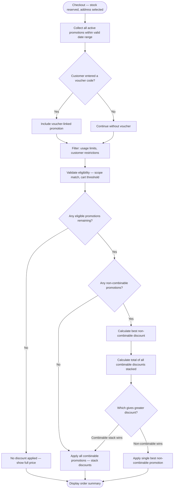

# Promotion Evaluation Process

**Document:** `docs/02-business-processes/promotion-evaluation-process.md`  
**Last Updated:** March 2025  
**Related Requirements:** PE-01 to PE-11, CC-04, CC-05  
**Related Processes:** [Order Process](./order-process.md)

---

## Overview

The promotion evaluation process determines which discounts apply to a customer's cart at checkout. It runs after stock reservation is confirmed and before the customer sees the final order summary.

This is the most rule-heavy process in the platform. The system must evaluate multiple promotion types, enforce combination restrictions, and produce a transparent price breakdown — all without requiring developer intervention when new campaigns are created.

---

## Promotion Types

The system supports four distinct promotion structures:

| Type | Description | Example |
|---|---|---|
| **Percentage discount** | A percentage reduction applied to eligible items or the cart total | 20% off all laptops |
| **Fixed-amount discount** | A flat monetary reduction | 500 TL off orders over 3.000 TL |
| **Category-scoped** | Discount applies only to items within a specific category | 10% off everything in Accessories |
| **Voucher code** | A customer-entered code that activates a specific promotion | Code `WELCOME50` for 50 TL off first order |

A single promotion can combine multiple attributes. For example: "15% off the Phones category for orders over 5.000 TL, activated by voucher code `PHONE15`, valid January 1–31, limited to 200 total uses, non-combinable."

---

## Promotion Attributes

Every promotion has the following configurable properties:

| Attribute | Description | Required |
|---|---|---|
| Name | Human-readable label for the admin panel | Yes |
| Discount type | Percentage or fixed amount | Yes |
| Discount value | The percentage or TL amount | Yes |
| Scope | Cart-level or category-level | Yes |
| Target category | If category-scoped, which category it applies to | Conditional |
| Minimum cart value | Cart must meet this threshold for the promotion to activate | No |
| Voucher code | If set, promotion only activates when this code is entered | No |
| Start date | Promotion becomes active at this date/time | Yes |
| End date | Promotion deactivates at this date/time | Yes |
| Active flag | Admin can manually enable/disable regardless of dates | Yes |
| Combinable flag | Whether this promotion can stack with others | Yes |
| Max total uses | Maximum number of times any customer can use this promotion | No |
| Customer restriction | If set, only this specific customer account can use the promotion | No |

---

## Evaluation Flow

### Step 1 — Collect Applicable Promotions

The system gathers all promotions that could potentially apply to the current cart:

1. Retrieve all promotions where `active = true` and current date is between `start_date` and `end_date`.
2. If the customer entered a voucher code, include promotions matching that code.
3. Filter out promotions that have reached their `max_total_uses` limit.
4. Filter out customer-restricted promotions that don't match the current customer.

### Step 2 — Validate Eligibility

For each candidate promotion, check:

1. **Scope match** — If cart-level, does the cart total meet the minimum threshold? If category-scoped, does the cart contain items from the target category?
2. **Usage limit** — Has this promotion (or voucher code) already been used by this customer, if it's single-use?

Remove any promotions that fail eligibility.

### Step 3 — Apply Combination Rules

This is the critical step. After filtering, the system may have multiple eligible promotions. The combination logic works as follows:

1. **Separate promotions into two groups:**
   - Combinable (`combinable = true`)
   - Non-combinable (`combinable = false`)

2. **If there are any non-combinable promotions:**
   - Only one non-combinable promotion can apply.
   - If multiple non-combinable promotions are eligible, the system selects the one that gives the customer the **greatest discount**.
   - A non-combinable promotion **cannot** be applied alongside any other promotion — not even combinable ones.

3. **If all eligible promotions are combinable:**
   - All of them apply. Discounts are calculated independently and summed.
   - Category-scoped discounts apply only to items in that category.
   - Cart-level discounts apply to the full cart total after category discounts.

4. **Compare outcomes:**
   - Calculate the total discount if only the best non-combinable promotion is applied.
   - Calculate the total discount if all combinable promotions are stacked.
   - Apply whichever scenario produces the greater discount for the customer.

### Step 4 — Calculate and Display

1. Apply the selected discount(s) to the cart.
2. The cart total cannot go below zero — if discounts exceed the cart value, the total is capped at zero.
3. Display an itemized breakdown showing each applied promotion, the discount amount, and the final total (CC-05).
4. If a voucher code was entered but is invalid, expired, or not eligible, display a clear error message.

---

## Flow Diagram

---

## Example Scenarios

### Scenario 1 — Single voucher code, no conflicts

**Active promotions:**
- `SUMMER10`: 10% off cart total, min 2.000 TL, combinable

**Cart:** 3.500 TL (two laptops)  
**Customer enters:** `SUMMER10`

**Result:** 10% off → 350 TL discount → Total: 3.150 TL

---

### Scenario 2 — Non-combinable vs. combinable stack

**Active promotions:**
- `BIGDEAL`: 1.500 TL off orders over 10.000 TL, **non-combinable**
- `LAPTOPS15`: 15% off Laptops category, combinable
- `LOYALTY200`: 200 TL off for returning customers, combinable

**Cart:** 12.000 TL (all laptops), returning customer

**Evaluation:**
- Non-combinable option: 1.500 TL off → Total: 10.500 TL
- Combinable stack: 15% of 12.000 = 1.800 + 200 = 2.000 TL off → Total: 10.000 TL
- **Combinable stack wins** → Total: 10.000 TL

---

### Scenario 3 — Category-scoped discount in a mixed cart

**Active promotions:**
- `ACCOFF`: 10% off Accessories category, no minimum, combinable

**Cart:** 8.000 TL laptop + 500 TL phone case (Accessories)

**Result:** 10% off the phone case only → 50 TL discount → Total: 8.450 TL

---

### Scenario 4 — Invalid voucher code

**Customer enters:** `EXPIRED2024`  
**Promotion:** Exists but `end_date` has passed.

**Result:** Error message — "This promotion code has expired." No discount applied.

---

## Edge Cases

| Scenario | Expected Behavior |
|---|---|
| Discount exceeds cart total | Cart total capped at zero — no negative orders |
| Voucher code entered but not linked to any promotion | Error: "Invalid promotion code" |
| Promotion was valid when cart was loaded but expired during checkout | Re-evaluated at order confirmation — expired promotion removed, customer notified |
| Admin deactivates a promotion while a customer is mid-checkout | Re-evaluated at order confirmation — deactivated promotion removed |
| Two non-combinable promotions with identical discount value | System selects the first one by creation date — deterministic, not random |

---

## Audit Trail

Promotion evaluation results are recorded as part of the order creation (see [Order Process](./order-process.md)):

| Data Point | Recorded |
|---|---|
| Promotions evaluated | Full list of candidate promotion IDs |
| Promotions applied | Applied promotion IDs with discount amounts |
| Promotions rejected | Rejected promotion IDs with rejection reason |
| Voucher code used | Code value, linked promotion ID |
| Combination decision | Which path was chosen (non-combinable vs. combinable stack) and why |
