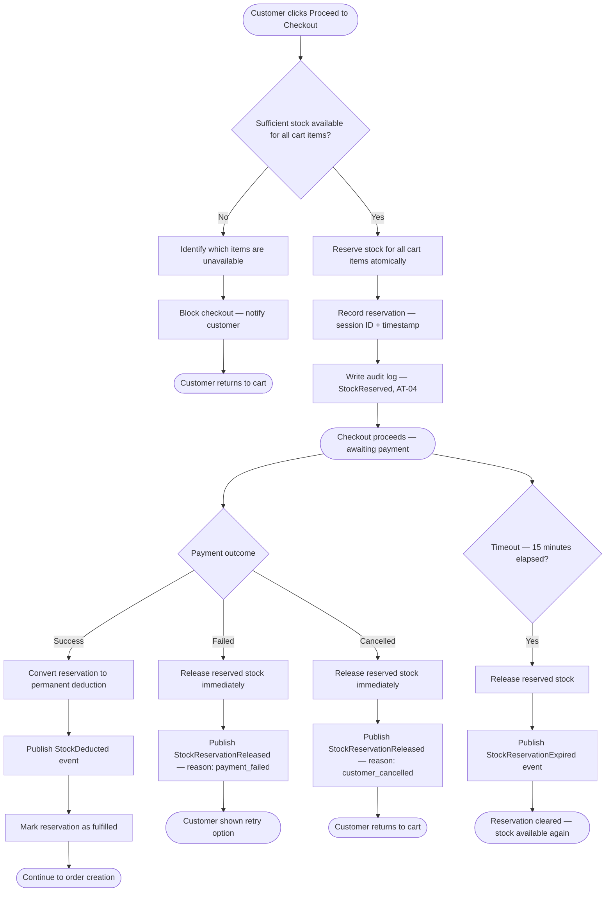

# Stock Reservation Process

**Document:** `docs/02-business-processes/stock-reservation-process.md`  
**Last Updated:** March 2025  
**Related Requirements:** IR-01 to IR-08, AT-04  
**Related Processes:** [Order Process](./order-process.md)

---

## Overview

Stock reservation is the mechanism that prevents overselling when multiple customers attempt to purchase the same product concurrently. It is triggered when a customer initiates checkout and released either by successful payment (permanent deduction) or by timeout/failure (stock returned to available).

This process operates independently from the order process but is invoked by it at two critical points:

1. **Checkout initiation** — reserve stock
2. **Payment result** — either convert reservation to permanent deduction (success) or release reservation (failure/timeout)

---

## Stock States

A product variant's stock exists in one of three states at any given time:

```
┌─────────────────────────────────────────────────┐
│              Total Physical Stock                │
│                                                  │
│   ┌──────────────┐    ┌──────────────────────┐   │
│   │  AVAILABLE   │    │     RESERVED         │   │
│   │  (sellable)  │    │  (held for checkout) │   │
│   └──────────────┘    └──────────────────────┘   │
│                                                  │
│   Available = Total - Reserved - Sold            │
└─────────────────────────────────────────────────┘
```

| State | Meaning |
|---|---|
| **Available** | Free to be added to cart and reserved by any customer |
| **Reserved** | Temporarily held for a specific checkout session. Not visible as available stock to other customers. |
| **Sold** | Permanently deducted after successful payment. No longer part of the sellable inventory. |

The stock count displayed to customers on product pages and in the cart reflects only the **Available** quantity.

---

## Reservation Lifecycle

### Phase 1 — Reserve on Checkout

When a customer clicks "Proceed to Checkout," the system attempts to reserve the requested quantity for each cart item.

**Rules:**
- Reservation is atomic per cart — either all items are reserved or none are. Partial reservation is not allowed.
- If any single item cannot be reserved (available quantity < requested quantity), the entire checkout is blocked and the customer is informed which items are unavailable.
- Each reservation is tagged with a session identifier and a creation timestamp.

### Phase 2 — Timeout (Automatic Release)

If the customer does not complete payment within the reservation window, the reserved stock is automatically released back to available.

**Configuration:**
- Default timeout: **15 minutes** from reservation creation.
- This value is system-configurable (IR-03) but not customer-facing.

**Mechanism:**
- A scheduled background job checks for expired reservations at regular intervals and releases them.
- Upon release, a `StockReservationExpired` event is published for audit purposes (AT-04).

### Phase 3a — Payment Success (Permanent Deduction)

When İyzico confirms successful payment:

1. The reservation is converted to a permanent deduction.
2. Available stock is not affected (it was already reduced at reservation time).
3. A `StockDeducted` event is published (AT-04).
4. The reservation record is marked as fulfilled.

### Phase 3b — Payment Failure or Cancellation (Immediate Release)

When payment fails or the customer cancels:

1. Reserved stock is immediately returned to available.
2. A `StockReservationReleased` event is published (AT-04).
3. The reservation record is marked as released with a reason (payment_failed / customer_cancelled).

---

## Flow Diagram



---

## Concurrency Handling

The most critical technical challenge in this process is preventing two customers from reserving the same last unit simultaneously. The following rules govern concurrency:

- **Stock reservation must be performed as an atomic operation** at the database level. The system must use optimistic locking or a similar mechanism to ensure that the available count cannot go below zero.
- If two concurrent requests attempt to reserve the last unit, exactly one must succeed and the other must fail with a clear "insufficient stock" response.
- **No distributed locking is required** for this project — the system runs as a modular monolith with a single database. Database-level locking is sufficient (NFR-03).

---

## Edge Cases

| Scenario | Expected Behavior |
|---|---|
| Customer has item in cart, stock drops to 0 before checkout | Checkout blocked, customer informed which item is out of stock |
| Two customers click checkout at the same time for the last unit | First reservation succeeds, second is rejected |
| Customer's reservation expires while they are on the payment page | Reservation released. If payment still succeeds via callback, the system must verify stock is still available before creating the order. If not, the payment is refunded. |
| Admin manually adjusts stock downward below current reservations | Existing reservations are honored. Admin sees a warning that available stock is negative. New reservations are blocked until stock is replenished. |
| Customer refreshes the checkout page during active reservation | Existing reservation is reused, not duplicated. Timeout timer is not reset. |

---

## Audit Events

| Event | Trigger | Data Recorded |
|---|---|---|
| `StockReserved` | Checkout initiated | Variant ID, quantity, session ID, reservation expiry time |
| `StockDeducted` | Payment confirmed | Variant ID, quantity, order number |
| `StockReservationReleased` | Payment failed or customer cancelled | Variant ID, quantity, reason |
| `StockReservationExpired` | Timeout elapsed | Variant ID, quantity, original session ID |
| `StockAdjusted` | Admin manual adjustment | Variant ID, previous quantity, new quantity, admin user ID |
