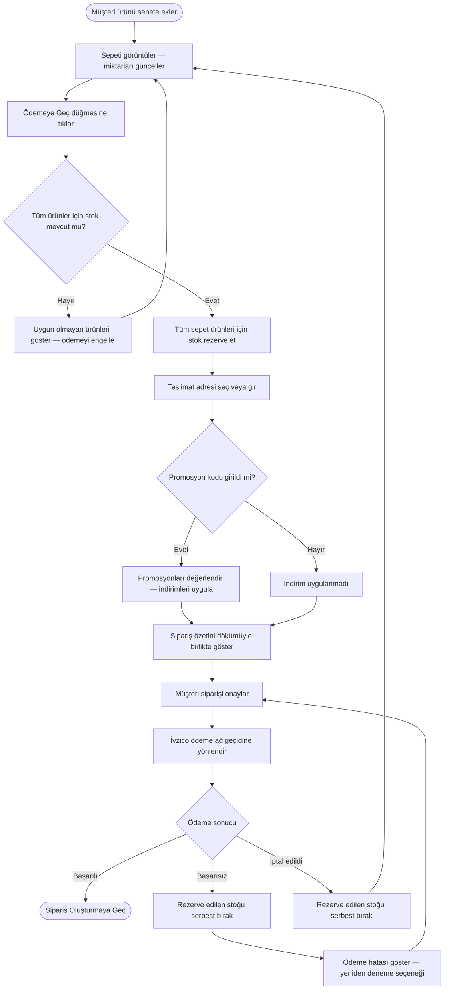
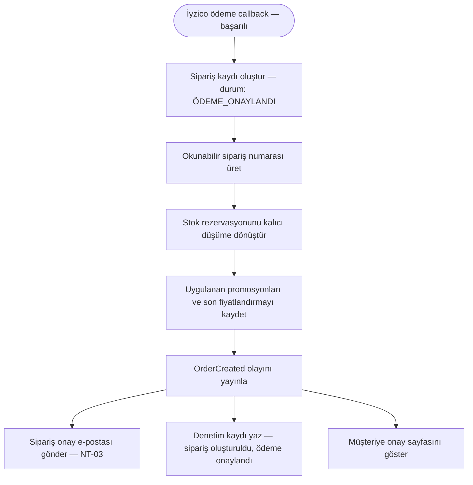
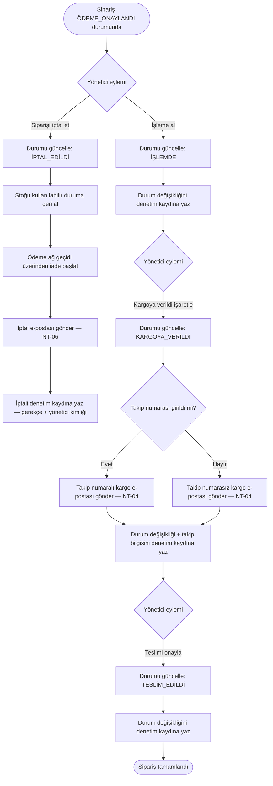

# Sipariş Süreci

**Belge:** `docs/02-business-processes/tr/order-process.md`  
**Son Güncelleme:** Mart 2025  
**İlgili Gereksinimler:** CC-01 – CC-09, OM-01 – OM-07, NT-03 – NT-06, AT-01 – AT-06, PAY-01 – PAY-03  
**İlgili Süreçler:** [Stok Rezervasyon Süreci](./stock-reservation-process.md) · [Promosyon Değerlendirme Süreci](./promotion-evaluation-process.md)

---

## Genel Bakış

Bu belge, bir müşterinin ürünü sepete eklemesinden teslimat (veya iptal) aşamasına kadar olan uçtan uca sipariş yaşam döngüsünü tanımlar. Platformun ana sürecidir ve diğer tüm iş süreçleriyle bir noktada kesişir.

Sipariş süreci üç aşamaya ayrılır:

1. **Müşteri Aşaması** — Sepet yönetimi, ödeme başlatma ve ödeme işlemi
2. **Sistem Aşaması** — Sipariş oluşturma, stok kalıcı düşümü ve bildirim gönderimi
3. **Yönetici Aşaması** — Sipariş karşılama ve durum yönetimi

---

## 1. Müşteri Aşaması — Sepetten Ödemeye

### 1.1 Sepet Yönetimi

Giriş yapmış bir müşteri, ürün kataloğunu inceler ve belirli bir varyant seçerek ürünleri sepetine ekler.

**Kurallar:**
- Her sepet kalemi, belirli bir ürün varyantını referans eder (ör. iPhone 15, 256GB, Siyah).
- Müşteri istediği zaman miktarları güncelleyebilir veya ürünleri kaldırabilir.
- Giriş yapmış müşteriler için sepet, tarayıcı oturumları arasında kalıcıdır (CC-03).
- Sepet, gerçek zamanlı stok durumunu gösterir. Bir varyantın stoğu sepetteyken tükenirse, ilgili ürün görsel olarak işaretlenir ve ödeme adımına geçilemez.

Bu aşamada stok rezervasyonu yapılmaz. Rezervasyon, yalnızca müşteri ödeme akışını başlattığında devreye girer (bkz. [Stok Rezervasyon Süreci](./stock-reservation-process.md)).

### 1.2 Ödeme Başlatma

Müşteri "Ödemeye Geç" düğmesine tıkladığında aşağıdaki adımlar sırayla gerçekleşir:

1. **Stok rezervasyonu tetiklenir** — Sistem, sepetteki tüm ürünler için talep edilen miktarları rezerve etmeye çalışır. Herhangi bir ürün rezerve edilemezse (yetersiz stok), ödeme engellenir ve müşteriye hangi ürünlerin uygun olmadığı bildirilir (CC-09). Detaylar için bkz. [Stok Rezervasyon Süreci](./stock-reservation-process.md).
2. **Teslimat adresi seçimi** — Müşteri, daha önce kaydettiği bir adresi seçer veya yeni bir adres girer (CC-06).
3. **Promosyon kodu girişi** — Müşteri bir kupon kodu girebilir. Sistem tüm uygulanabilir promosyonları değerlendirir ve indirimlerin kalem bazlı dökümünü gösterir (CC-04, CC-05). Kural değerlendirme detayları için bkz. [Promosyon Değerlendirme Süreci](./promotion-evaluation-process.md).
4. **Sipariş özeti** — Sistem son bir özet sunar: ürünler, miktarlar, birim fiyatlar, uygulanan indirimler, ara toplam, kargo ücreti ve genel toplam.
5. **Müşteri onayı** — Müşteri siparişi inceler ve onaylar.

### 1.3 Ödeme

Onay sonrasında müşteri, İyzico ödeme ağ geçidine yönlendirilir (PAY-01, CC-07).

**Platform hiçbir aşamada kart verisini işlemez veya saklamaz (PAY-02).**

İyzico ödemeyi işler ve müşteriyi üç olası sonuçtan biriyle platforma geri yönlendirir:

- **Ödeme başarılı** → sipariş oluşturmaya geçilir (Bölüm 2)
- **Ödeme başarısız** → rezerve edilen stok serbest bırakılır, müşteriye yeniden deneme seçeneğiyle hata gösterilir
- **Ödeme müşteri tarafından iptal edildi** → rezerve edilen stok serbest bırakılır, müşteri sepete döner

### Akış Diyagramı — Müşteri Aşaması



---

## 2. Sistem Aşaması — Sipariş Oluşturma ve Bildirim

İyzico başarılı ödemeyi onayladığında, sistem aşağıdaki adımları tek bir mantıksal işlem olarak gerçekleştirir:

1. **Sipariş kaydını oluştur** — Benzersiz ve okunabilir bir sipariş numarasıyla oluşturulur (OM-01). Başlangıç durumu: `ÖDEME_ONAYLANDI`.
2. **Rezerve edilen stoğu kalıcı olarak düş** — Rezervasyon, kalıcı düşüme dönüştürülür (IR-04).
3. **Uygulanan promosyonları kaydet** — Hangi promosyonların uygulandığı, indirim tutarları ve ödenen son fiyat siparişle birlikte saklanır (OM-06).
4. **`OrderCreated` domain olayını yayınla** — Bu olay şunları tetikler:
   - **Müşteriye e-posta bildirimi**: sipariş numarası, ürünler ve toplam tutar içeren sipariş onayı (NT-03, CC-08).
   - **Denetim kaydı girdisi**: sipariş oluşturuldu, ödeme onaylandı, stok düşüldü (AT-01, AT-03).
5. **Müşteriye onay sayfasını göster** (CC-08).

### Akış Diyagramı — Sistem Aşaması



---

## 3. Yönetici Aşaması — Karşılama ve Durum Yönetimi

Sipariş `ÖDEME_ONAYLANDI` durumuyla oluşturulduktan sonra, yönetici onu yaşam döngüsü boyunca yönetir.

### Sipariş Durum Yaşam Döngüsü

```
ÖDEME_ONAYLANDI → İŞLEMDE → KARGOYA_VERİLDİ → TESLİM_EDİLDİ
            ↘         ↘
          İPTAL_EDİLDİ  İPTAL_EDİLDİ
```

| Geçiş | Kim | Eylem | Bildirim | Denetim |
|---|---|---|---|---|
| `ÖDEME_ONAYLANDI` → `İŞLEMDE` | Yönetici | Siparişi kargoya hazırlamaya başlar | — | ✅ Durum değişikliği kaydedilir |
| `İŞLEMDE` → `KARGOYA_VERİLDİ` | Yönetici | Kargoya verildi olarak işaretler, isteğe bağlı takip numarası ekler | Müşteriye takip bilgili e-posta (NT-04) | ✅ Durum değişikliği + takip bilgisi kaydedilir |
| `KARGOYA_VERİLDİ` → `TESLİM_EDİLDİ` | Yönetici | Teslimi onaylar | — | ✅ Durum değişikliği kaydedilir |
| `ÖDEME_ONAYLANDI` veya `İŞLEMDE` → `İPTAL_EDİLDİ` | Yönetici | Siparişi iptal eder (OM-07) | Müşteriye e-posta (NT-06) | ✅ İptal kaydedilir |

### İptal Kuralları

- Bir sipariş yalnızca `ÖDEME_ONAYLANDI` veya `İŞLEMDE` durumundayken iptal edilebilir.
- `KARGOYA_VERİLDİ` durumundaki bir sipariş yönetici panelinden iptal edilemez.
- Bir sipariş iptal edildiğinde:
  1. Stok, kullanılabilir envantere geri eklenir.
  2. Ödeme ağ geçidi üzerinden iade başlatılır.
  3. Müşteriye iptal bildirimi e-postası gönderilir (NT-06).
  4. İptal gerekçesi ve işlemi yapan yönetici, denetim kaydına yazılır (AT-02).

### Akış Diyagramı — Yönetici Aşaması



---

## Denetim Kaydı Özeti

Sipariş yaşam döngüsündeki her durum geçişi ve anlamlı aksiyon, değiştirilemez bir denetim kaydı üretir (AT-05). Aşağıdaki olaylar kayıt altına alınır:

| Olay | Aktör | Kaydedilen Veri |
|---|---|---|
| Sipariş oluşturuldu | Sistem | Sipariş numarası, müşteri ID, ürünler, toplam, ödeme referansı |
| Ödeme onaylandı | Sistem | Ödeme ağ geçidi referansı, tutar, zaman damgası |
| Stok düşüldü | Sistem | Varyant ID'leri, düşülen miktarlar |
| Promosyon uygulandı | Sistem | Promosyon ID'leri, indirim tutarları, uygulanan birleştirme kuralları |
| Durum değiştirildi | Yönetici | Önceki durum, yeni durum, yönetici kullanıcı ID |
| Takip numarası eklendi | Yönetici | Kargo firması, takip numarası |
| Sipariş iptal edildi | Yönetici | İptal gerekçesi, yönetici kullanıcı ID, iade referansı |
| E-posta gönderildi | Sistem | E-posta türü, alıcı, gönderim zaman damgası, teslim durumu |

Bu denetim kaydına yöneticiler sipariş detay görünümü üzerinden erişebilir (AT-06) ve kayıtlar düzenlenemez veya silinemez (AT-05).
