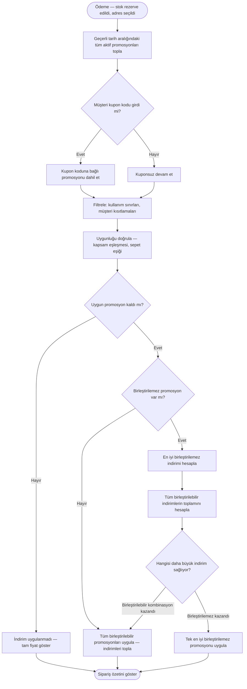

# Promosyon Değerlendirme Süreci

**Belge:** `docs/02-business-processes/tr/promotion-evaluation-process.md`  
**Son Güncelleme:** Mart 2025  
**İlgili Gereksinimler:** PE-01 – PE-11, CC-04, CC-05  
**İlgili Süreçler:** [Sipariş Süreci](./order-process.md)

---

## Genel Bakış

Promosyon değerlendirme süreci, ödeme aşamasında müşterinin sepetine hangi indirimlerin uygulanacağını belirler. Stok rezervasyonu onaylandıktan sonra ve müşteri son sipariş özetini görmeden önce çalışır.

Bu, platformdaki en kural ağırlıklı süreçtir. Sistem; birden fazla promosyon türünü değerlendirmek, birleştirme kısıtlamalarını uygulamak ve şeffaf bir fiyat dökümü üretmek zorundadır — üstelik tüm bunları, yeni kampanyalar oluşturulduğunda geliştirici müdahalesi gerektirmeden yapmalıdır.

---

## Promosyon Türleri

Sistem dört farklı promosyon yapısını destekler:

| Tür | Açıklama | Örnek |
|---|---|---|
| **Yüzdelik indirim** | Uygun ürünlere veya sepet toplamına uygulanan yüzdesel azaltma | Tüm laptoplarda %20 indirim |
| **Sabit tutarlı indirim** | Sabit parasal azaltma | 3.000 TL üzeri siparişlerde 500 TL indirim |
| **Kategoriye özel** | İndirim yalnızca belirli bir kategori içindeki ürünlere uygulanır | Aksesuar kategorisindeki her şeyde %10 indirim |
| **Kupon kodu** | Müşterinin girdiği ve belirli bir promosyonu tetikleyen kod | İlk siparişte 50 TL indirim için `WELCOME50` kodu |

Tek bir promosyon birden fazla özelliği birleştirebilir. Örneğin: "5.000 TL üzeri Telefon kategorisi siparişlerinde %15 indirim, `PHONE15` kupon koduyla etkinleşir, 1–31 Ocak arası geçerli, toplam 200 kullanımla sınırlı, birleştirilemez."

---

## Promosyon Özellikleri

Her promosyon aşağıdaki yapılandırılabilir özelliklere sahiptir:

| Özellik | Açıklama | Zorunlu |
|---|---|---|
| Ad | Yönetici paneli için okunabilir etiket | Evet |
| İndirim türü | Yüzdelik veya sabit tutar | Evet |
| İndirim değeri | Yüzde oranı veya TL tutarı | Evet |
| Kapsam | Sepet düzeyi veya kategori düzeyi | Evet |
| Hedef kategori | Kategoriye özel ise hangi kategoriye uygulandığı | Koşullu |
| Minimum sepet tutarı | Promosyonun aktif olması için sepetin bu eşiği karşılaması gerekir | Hayır |
| Kupon kodu | Ayarlandıysa promosyon yalnızca bu kod girildiğinde etkinleşir | Hayır |
| Başlangıç tarihi | Promosyonun aktif olacağı tarih/saat | Evet |
| Bitiş tarihi | Promosyonun deaktif olacağı tarih/saat | Evet |
| Aktif bayrağı | Yöneticinin tarihlerden bağımsız olarak manuel etkinleştirme/devre dışı bırakma yapabilmesi | Evet |
| Birleştirilebilir bayrağı | Bu promosyonun diğerleriyle birlikte uygulanıp uygulanamayacağı | Evet |
| Maksimum toplam kullanım | Herhangi bir müşterinin bu promosyonu kullanabileceği maksimum toplam sayı | Hayır |
| Müşteri kısıtlaması | Ayarlandıysa yalnızca bu belirli müşteri hesabı promosyonu kullanabilir | Hayır |

---

## Değerlendirme Akışı

### Adım 1 — Uygulanabilir Promosyonları Topla

Sistem, mevcut sepete potansiyel olarak uygulanabilecek tüm promosyonları toplar:

1. `active = true` olan ve mevcut tarihin `başlangıç_tarihi` ile `bitiş_tarihi` arasında olduğu tüm promosyonları getir.
2. Müşteri bir kupon kodu girdiyse, o kodla eşleşen promosyonları dahil et.
3. `maksimum_toplam_kullanım` sınırına ulaşmış promosyonları çıkar.
4. Mevcut müşteriyle eşleşmeyen müşteriye özel promosyonları çıkar.

### Adım 2 — Uygunluğu Doğrula

Her aday promosyon için kontrol et:

1. **Kapsam eşleşmesi** — Sepet düzeyindeyse sepet toplamı minimum eşiği karşılıyor mu? Kategoriye özelse sepette hedef kategoriden ürün var mı?
2. **Kullanım sınırı** — Tek kullanımlık bir promosyonsa bu müşteri tarafından zaten kullanılmış mı?

Uygunluk kontrolünden geçemeyen promosyonları çıkar.

### Adım 3 — Birleştirme Kurallarını Uygula

Bu en kritik adımdır. Filtrelemeden sonra geriye birden fazla uygun promosyon kalmış olabilir. Birleştirme mantığı şöyle çalışır:

1. **Promosyonları iki gruba ayır:**
   - Birleştirilebilir (`birleştirilebilir = true`)
   - Birleştirilemez (`birleştirilebilir = false`)

2. **Birleştirilemez promosyon varsa:**
   - Yalnızca bir birleştirilemez promosyon uygulanabilir.
   - Birden fazla birleştirilemez promosyon uygunsa, sistem müşteriye **en yüksek indirimi** sağlayanı seçer.
   - Birleştirilemez promosyon, diğer hiçbir promosyonla birlikte uygulanamaz — birleştirilebilir olanlarla bile.

3. **Tüm uygun promosyonlar birleştirilebilirse:**
   - Hepsi uygulanır. İndirimler bağımsız hesaplanır ve toplanır.
   - Kategoriye özel indirimler yalnızca o kategorideki ürünlere uygulanır.
   - Sepet düzeyi indirimler, kategori indirimlerinden sonraki toplam sepet tutarına uygulanır.

4. **Sonuçları karşılaştır:**
   - Yalnızca en iyi birleştirilemez promosyon uygulanırsa toplam indirimi hesapla.
   - Tüm birleştirilebilir promosyonlar birlikte uygulanırsa toplam indirimi hesapla.
   - Hangisi müşteri için daha büyük indirim üretiyorsa onu uygula.

### Adım 4 — Hesapla ve Göster

1. Seçilen indirim(ler)i sepete uygula.
2. Sepet toplamı sıfırın altına düşemez — indirimler sepet değerini aşarsa toplam sıfıra sabitlenir.
3. Her uygulanan promosyonu, indirim tutarını ve son toplamı gösteren kalem bazlı döküm göster (CC-05).
4. Kupon kodu girilmiş ancak geçersiz, süresi dolmuş veya uygun değilse net bir hata mesajı göster.

---

## Akış Diyagramı

---

## Örnek Senaryolar

### Senaryo 1 — Tek kupon kodu, çakışma yok

**Aktif promosyonlar:**
- `SUMMER10`: Sepet toplamında %10 indirim, min 2.000 TL, birleştirilebilir

**Sepet:** 3.500 TL (iki laptop)  
**Müşteri girer:** `SUMMER10`

**Sonuç:** %10 indirim → 350 TL indirim → Toplam: 3.150 TL

---

### Senaryo 2 — Birleştirilemez vs. birleştirilebilir kombinasyon

**Aktif promosyonlar:**
- `BIGDEAL`: 10.000 TL üzeri siparişlerde 1.500 TL indirim, **birleştirilemez**
- `LAPTOPS15`: Laptop kategorisinde %15 indirim, birleştirilebilir
- `LOYALTY200`: Tekrar gelen müşteriler için 200 TL indirim, birleştirilebilir

**Sepet:** 12.000 TL (tümü laptop), tekrar gelen müşteri

**Değerlendirme:**
- Birleştirilemez seçenek: 1.500 TL indirim → Toplam: 10.500 TL
- Birleştirilebilir kombinasyon: 12.000'in %15'i = 1.800 + 200 = 2.000 TL indirim → Toplam: 10.000 TL
- **Birleştirilebilir kombinasyon kazandı** → Toplam: 10.000 TL

---

### Senaryo 3 — Karışık sepette kategoriye özel indirim

**Aktif promosyonlar:**
- `ACCOFF`: Aksesuar kategorisinde %10 indirim, minimum yok, birleştirilebilir

**Sepet:** 8.000 TL laptop + 500 TL telefon kılıfı (Aksesuar)

**Sonuç:** Yalnızca telefon kılıfında %10 indirim → 50 TL indirim → Toplam: 8.450 TL

---

### Senaryo 4 — Geçersiz kupon kodu

**Müşteri girer:** `EXPIRED2024`  
**Promosyon:** Mevcut ancak `bitiş_tarihi` geçmiş.

**Sonuç:** Hata mesajı — "Bu promosyon kodunun süresi dolmuş." İndirim uygulanmadı.

---

## Uç Durumlar (Edge Cases)

| Senaryo | Beklenen Davranış |
|---|---|
| İndirim sepet toplamını aşıyor | Sepet toplamı sıfıra sabitlenir — negatif sipariş oluşmaz |
| Kupon kodu girildi ancak hiçbir promosyona bağlı değil | Hata: "Geçersiz promosyon kodu" |
| Promosyon sepet yüklendiğinde geçerliydi ancak ödeme sırasında süresi doldu | Sipariş onayında yeniden değerlendirilir — süresi dolan promosyon kaldırılır, müşteri bilgilendirilir |
| Yönetici, müşteri ödeme sırasındayken bir promosyonu devre dışı bırakıyor | Sipariş onayında yeniden değerlendirilir — deaktif edilen promosyon kaldırılır |
| İki birleştirilemez promosyon aynı indirim tutarını veriyor | Sistem oluşturulma tarihine göre ilkini seçer — belirleyici, rastgele değil |

---

## Denetim Kaydı

Promosyon değerlendirme sonuçları sipariş oluşturmanın parçası olarak kaydedilir (bkz. [Sipariş Süreci](./order-process.md)):

| Veri Noktası | Kaydedilen |
|---|---|
| Değerlendirilen promosyonlar | Aday promosyon ID'lerinin tam listesi |
| Uygulanan promosyonlar | Uygulanan promosyon ID'leri ve indirim tutarları |
| Reddedilen promosyonlar | Reddedilen promosyon ID'leri ve reddedilme gerekçesi |
| Kullanılan kupon kodu | Kod değeri, bağlı promosyon ID'si |
| Birleştirme kararı | Hangi yolun seçildiği (birleştirilemez vs. birleştirilebilir yığın) ve nedeni |
