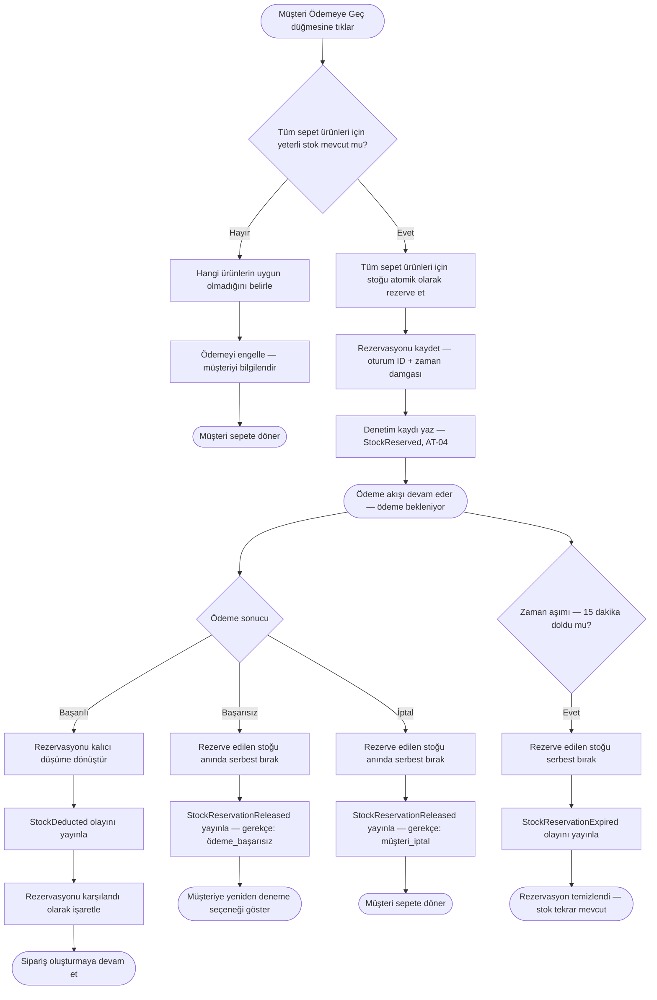

# Stok Rezervasyon Süreci

**Belge:** `docs/02-business-processes/tr/stock-reservation-process.md`  
**Son Güncelleme:** Mart 2025  
**İlgili Gereksinimler:** IR-01 – IR-08, AT-04  
**İlgili Süreçler:** [Sipariş Süreci](./order-process.md)

---

## Genel Bakış

Stok rezervasyonu, birden fazla müşterinin aynı ürünü eş zamanlı satın almaya çalışması durumunda aşırı satışı önleyen mekanizmadır. Müşteri ödeme akışını başlattığında tetiklenir ve başarılı ödeme (kalıcı düşüm) ya da zaman aşımı/başarısızlık (stok serbest bırakılır) ile sonuçlanır.

Bu süreç sipariş sürecinden bağımsız çalışır ancak iki kritik noktada onun tarafından çağrılır:

1. **Ödeme başlatma** — stoğu rezerve et
2. **Ödeme sonucu** — başarı durumunda rezervasyonu kalıcı düşüme dönüştür, başarısızlık/zaman aşımında rezervasyonu serbest bırak

---

## Stok Durumları

Bir ürün varyantının stoğu, herhangi bir anda üç durumdan birinde bulunur:

```
┌─────────────────────────────────────────────────┐
│              Toplam Fiziksel Stok                │
│                                                  │
│   ┌──────────────┐    ┌──────────────────────┐   │
│   │    MEVCUT     │    │     REZERVE          │   │
│   │ (satılabilir) │    │ (ödeme için ayrılmış)│   │
│   └──────────────┘    └──────────────────────┘   │
│                                                  │
│   Mevcut = Toplam - Rezerve - Satılmış           │
└─────────────────────────────────────────────────┘
```

| Durum | Anlamı |
|---|---|
| **Mevcut** | Herhangi bir müşteri tarafından sepete eklenebilir ve rezerve edilebilir |
| **Rezerve** | Belirli bir ödeme oturumu için geçici olarak bloke edilmiş. Diğer müşterilere mevcut stok olarak gösterilmez. |
| **Satılmış** | Başarılı ödeme sonrası kalıcı olarak düşülmüş. Artık satılabilir envanterin parçası değil. |

Ürün sayfalarında ve sepette müşterilere gösterilen stok miktarı yalnızca **Mevcut** miktarı yansıtır.

---

## Rezervasyon Yaşam Döngüsü

### Faz 1 — Ödeme Başlatıldığında Rezerve Et

Müşteri "Ödemeye Geç" düğmesine tıkladığında sistem, sepetteki her ürün için talep edilen miktarı rezerve etmeye çalışır.

**Kurallar:**
- Rezervasyon sepet bazında atomiktir — ya tüm ürünler rezerve edilir ya da hiçbiri edilmez. Kısmi rezervasyon yapılmaz.
- Herhangi bir ürün rezerve edilemezse (mevcut miktar < talep edilen miktar), tüm ödeme akışı engellenir ve müşteriye hangi ürünlerin uygun olmadığı bildirilir.
- Her rezervasyon, bir oturum kimliği ve oluşturulma zaman damgası ile etiketlenir.

### Faz 2 — Zaman Aşımı (Otomatik Serbest Bırakma)

Müşteri, rezervasyon süresi içinde ödemeyi tamamlamazsa, rezerve edilen stok otomatik olarak mevcut duruma geri döndürülür.

**Yapılandırma:**
- Varsayılan zaman aşımı: rezervasyon oluşturulmasından itibaren **15 dakika**.
- Bu değer sistem düzeyinde yapılandırılabilir (IR-03) ancak müşteriye gösterilmez.

**Mekanizma:**
- Zamanlanmış bir arka plan görevi, düzenli aralıklarla süresi dolmuş rezervasyonları kontrol eder ve serbest bırakır.
- Serbest bırakma işleminde denetim amacıyla bir `StockReservationExpired` olayı yayınlanır (AT-04).

### Faz 3a — Ödeme Başarılı (Kalıcı Düşüm)

İyzico başarılı ödemeyi onayladığında:

1. Rezervasyon kalıcı düşüme dönüştürülür.
2. Mevcut stok etkilenmez (rezervasyon anında zaten düşülmüştü).
3. Bir `StockDeducted` olayı yayınlanır (AT-04).
4. Rezervasyon kaydı "karşılandı" olarak işaretlenir.

### Faz 3b — Ödeme Başarısız veya İptal (Anında Serbest Bırakma)

Ödeme başarısız olduğunda veya müşteri iptal ettiğinde:

1. Rezerve edilen stok anında mevcut duruma döndürülür.
2. Bir `StockReservationReleased` olayı yayınlanır (AT-04).
3. Rezervasyon kaydı, bir gerekçeyle (ödeme_başarısız / müşteri_iptal) "serbest bırakıldı" olarak işaretlenir.

---

## Akış Diyagramı



---

## Eşzamanlılık Yönetimi

Bu süreçteki en kritik teknik zorluk, iki müşterinin aynı son birimi eş zamanlı rezerve etmesini önlemektir. Eşzamanlılığı yöneten kurallar:

- **Stok rezervasyonu, veritabanı seviyesinde atomik bir işlem olarak gerçekleştirilmelidir.** Sistem, mevcut sayının sıfırın altına düşmemesini garanti etmek için iyimser kilitleme (optimistic locking) veya benzeri bir mekanizma kullanmalıdır.
- İki eşzamanlı istek son birimi rezerve etmeye çalışırsa, tam olarak biri başarılı olmalı ve diğeri net bir "yetersiz stok" yanıtıyla reddedilmelidir.
- **Bu proje için dağıtık kilitleme gerekmez** — sistem tek veritabanlı bir modüler monolit olarak çalışır. Veritabanı seviyesi kilitleme yeterlidir (NFR-03).

---

## Uç Durumlar (Edge Cases)

| Senaryo | Beklenen Davranış |
|---|---|
| Müşterinin sepetinde ürün var, ödeme öncesi stok 0'a düşüyor | Ödeme engellenir, müşteriye hangi ürünün tükendiği bildirilir |
| İki müşteri aynı anda son birim için ödemeye tıklıyor | İlk rezervasyon başarılı olur, ikincisi reddedilir |
| Müşterinin rezervasyonu, ödeme sayfasındayken sona eriyor | Rezervasyon serbest bırakılır. Ödeme yine de callback ile başarılı olursa, sistem sipariş oluşturmadan önce stoğun hâlâ mevcut olduğunu doğrulamalıdır. Değilse ödeme iade edilir. |
| Yönetici stoğu, mevcut rezervasyonların altına manuel düşürüyor | Mevcut rezervasyonlara dokunulmaz. Yönetici, mevcut stoğun negatif olduğuna dair uyarı görür. Stok yenilenene kadar yeni rezervasyonlar engellenir. |
| Müşteri aktif rezervasyon sırasında ödeme sayfasını yeniliyor | Mevcut rezervasyon yeniden kullanılır, çoğaltılmaz. Zaman aşımı zamanlayıcısı sıfırlanmaz. |

---

## Denetim Olayları

| Olay | Tetikleyici | Kaydedilen Veri |
|---|---|---|
| `StockReserved` | Ödeme başlatıldı | Varyant ID, miktar, oturum ID, rezervasyon bitiş zamanı |
| `StockDeducted` | Ödeme onaylandı | Varyant ID, miktar, sipariş numarası |
| `StockReservationReleased` | Ödeme başarısız veya müşteri iptal etti | Varyant ID, miktar, gerekçe |
| `StockReservationExpired` | Zaman aşımı doldu | Varyant ID, miktar, orijinal oturum ID |
| `StockAdjusted` | Yönetici manuel düzenleme | Varyant ID, önceki miktar, yeni miktar, yönetici kullanıcı ID |
