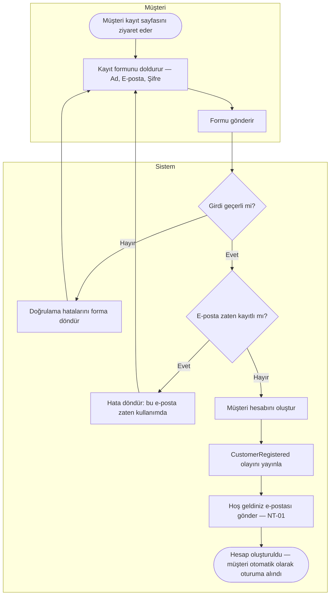
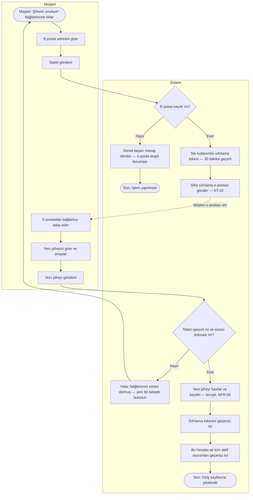

# Kullanıcı Kaydı Süreci

**Belge:** `docs/02-business-processes/tr/user-registration.md`  
**Son Güncelleme:** Mart 2025  
**İlgili Gereksinimler:** UR-01, UR-02, UR-03, NT-01, NT-02

---

## Genel Bakış

Bu belge, birbiriyle ilişkili üç kimlik akışını kapsamaktadır:

1. **Hesap Kaydı** — Yeni bir müşteri, e-posta ve şifre kullanarak hesap oluşturur.
2. **Giriş / Çıkış** — Daha önce kayıtlı bir müşteri sisteme giriş yapar ve oturumunu sonlandırır.
3. **Şifre Sıfırlama** — Şifresini unutan müşteri, e-posta yoluyla sıfırlama bağlantısı talep eder.

Bu akışlar, sipariş süreci için ön koşullardır. Bir müşterinin satın alma işlemini tamamlayabilmesi, adreslerini kaydedebilmesi ve sipariş geçmişini görüntüleyebilmesi için kimlik doğrulamasının yapılmış olması gerekir.

---

## 1. Hesap Kaydı

### Açıklama

Yeni bir müşteri, kayıt formunu doldurarak gönderir. Sistem girdiyi doğrular, e-posta adresinin daha önce kullanılmadığını kontrol eder, hesabı oluşturur ve bir hoş geldiniz e-postası gönderir.

**Hata senaryoları:**
- Geçersiz girdi (ör. hatalı e-posta formatı, zayıf şifre) → form seviyesinde hata mesajı; hesap oluşturulmaz.
- E-posta adresi zaten kayıtlı → özel hata mesajı döndürülür; yinelenen hesap oluşturulmaz.

### Akış Diyagramı

### Notlar

- Şifreler bcrypt ile hashlenerek saklanır — asla düz metin olarak tutulmaz (NFR-05).
- Başarılı kayıt sonrasında müşteri, ayrı bir giriş adımı gerektirmeksizin otomatik olarak oturuma alınır.
- Hoş geldiniz e-postası, kayıt modülünden doğrudan değil; `CustomerRegistered` alan olayı (domain event) tarafından tetiklenir. Bu yaklaşım, kayıt mantığını bildirim kaygısından ayırır ve modüller arası bağımlılığı azaltır.
- **Bu aşamada e-posta doğrulaması zorunlu değildir.** Kayıt sonrası hoş geldiniz e-postası (NT-01) gönderilir ancak hesap aktivasyonu buna bağlı değildir. Müşteri hemen alışverişe başlayabilir.

---

## 2. Giriş ve Çıkış

### Açıklama

Giriş ve çıkış işlemleri kasıtlı olarak basit tutulmuştur. İlk sürüm kapsamında çok faktörlü kimlik doğrulama (MFA) yer almamaktadır.

**Giriş akışı:**
1. Müşteri e-posta ve şifresini gönderir.
2. Sistem kimlik bilgilerini doğrular.
3. Başarı durumunda: erişim tokeni (30 dakika geçerli) ve yenileme tokeni (7 gün geçerli) oluşturulur (NFR-06).
4. Başarısızlık durumunda: genel bir hata mesajı döndürülür. Mesaj, e-postanın mı yoksa şifrenin mi yanlış olduğunu belirtmez (hesap tespit saldırısı engeli).

**Çıkış akışı:**
1. Müşteri çıkış yapar.
2. Oturum tokeni sunucu tarafında geçersiz kılınır.
3. Müşteri ana sayfaya yönlendirilir.

Bu akışlar için diyagram oluşturulmamıştır — doğrusal yapıda olup kimlik bilgisi doğrulaması dışında anlamlı bir dallanma içermemektedir.

---

## 3. Şifre Sıfırlama

### Açıklama

Giriş yapamayan bir müşteri, şifre sıfırlama talebinde bulunur. Sistem, kayıtlı e-posta adresine süre sınırlı bir sıfırlama bağlantısı gönderir. Müşteri bağlantıyı takip ederek yeni şifresini belirler.

**Güvenlik önlemleri:**
- Girilen e-posta adresi **kayıtlı değilse** sistem yine de başarı mesajı döndürür. Bu yaklaşım, bir saldırganın sıfırlama formunu kullanarak belirli e-posta adreslerinin sistemde kayıtlı olup olmadığını tespit etmesini engeller (e-posta tespit koruması).
- Sıfırlama tokenleri tek kullanımlıktır ve **30 dakika** sonra geçersiz olur.
- Başarılı sıfırlama işleminin ardından, ilgili hesaba ait **tüm aktif oturumlar** geçersiz kılınır.

### Akış Diyagramı

