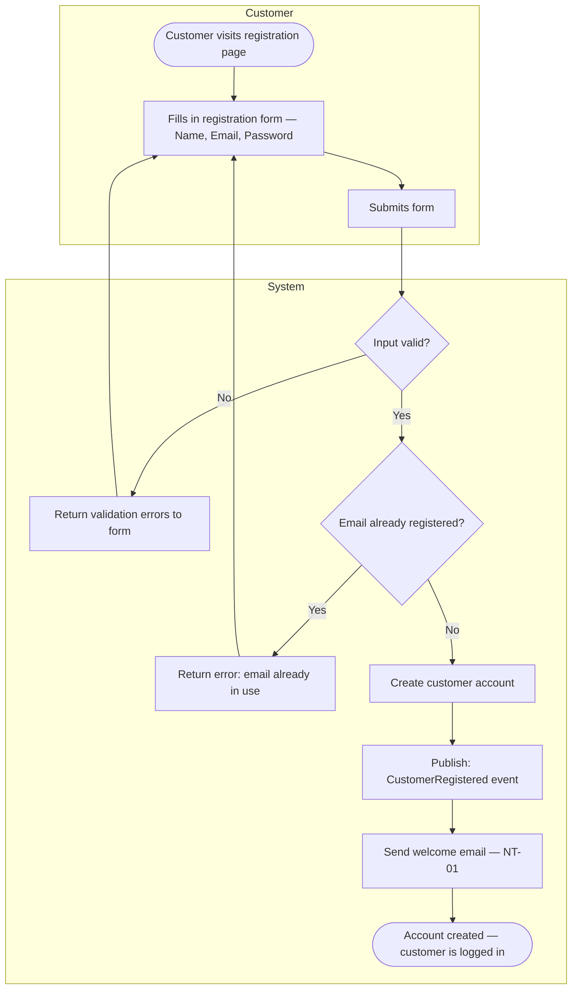
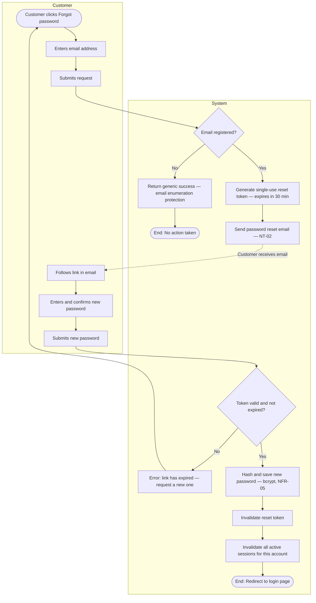

# User Registration Process

**Document:** `docs/02-business-processes/user-registration.md`  
**Last Updated:** March 2025  
**Related Requirements:** UR-01, UR-02, UR-03, NT-01, NT-02

---

## Overview

This document covers three related identity flows:

1. **Account Registration** — A new customer creates an account using email and password.
2. **Login / Logout** — A returning customer authenticates and ends their session.
3. **Password Reset** — A customer who has forgotten their password requests a reset link via email.

These flows are prerequisites for the order process. A customer must be authenticated to complete a purchase, save addresses, and view order history.

---

## 1. Account Registration

### Description

A new customer submits a registration form. The system validates the input, checks that the email is not already in use, creates the account, and sends a welcome email.

**Error paths:**
- Invalid input (e.g., malformed email, weak password) → form-level error, no account created.
- Email already registered → specific error returned, no duplicate account created.

### Flow Diagram

### Notes

- Passwords are stored as bcrypt hashes — never in plain text (NFR-05).
- After successful registration, the customer is automatically logged in without requiring a separate step.
- The welcome email is triggered by the `CustomerRegistered` domain event, not by the registration handler directly. This keeps the registration logic decoupled from the notification concern.
- **Email verification is not required at this stage.** A welcome email (NT-01) is sent upon registration, but account activation does not depend on it. The customer can browse and purchase immediately.

---

## 2. Login and Logout

### Description

Login and logout are intentionally kept simple. There is no multi-factor authentication in scope for the initial release.

**Login flow:**
1. Customer submits email and password.
2. System verifies credentials.
3. On success: an access token (30-minute expiry) and a refresh token (7-day expiry) are issued (NFR-06).
4. On failure: a generic error is returned. The error message does not specify whether the email or the password was incorrect (prevents account enumeration).

**Logout flow:**
1. Customer clicks logout.
2. Session token is invalidated server-side.
3. Customer is redirected to the homepage.

No diagram is provided for these flows — they are linear and contain no meaningful branching beyond credential validation.

---

## 3. Password Reset

### Description

A customer who cannot log in requests a password reset. The system sends a time-limited reset link to the registered email address. The customer follows the link and sets a new password.

**Security considerations:**
- If the submitted email is **not registered**, the system still returns a success message. This prevents an attacker from using the reset form to confirm whether a given email address has an account (email enumeration prevention).
- Reset tokens are single-use and expire after **30 minutes**.
- After a successful reset, **all active sessions** for that account are invalidated.

### Flow Diagram

